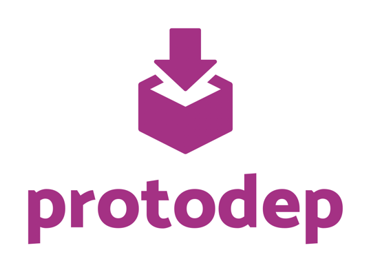

protodep
=======




[](https://golang.org/)
[](https://github.com/stormcat24/protodep/issues?state=open)
[](LICENSE)
[](https://godoc.org/github.com/stormcat24/protodep)
[](go.mod)

Dependency tool for Protocol Buffers IDL file (.proto) vendoring tool.


## Motivation

In building Microservices architecture, gRPC with Protocol Buffers is effective. When using gRPC, your application will depend on many remote services.

If you manage proto files in a git repository, what will you do? Most remote services are managed by git and they will be versioned. We need to control which dependency service version that application uses.


## Install

### go install

```bash
$ go install -v github.com/stormcat24/protodep@v0.1.7
```

### from binary

Support as follows:

* protodep_darwin_amd64.tar.gz
* protodep_darwin_arm64.tar.gz
* protodep_linux_386.tar.gz
* protodep_linux_amd64.tar.gz
* protodep_linux_arm.tar.gz
* protodep_linux_arm64.tar.gz

```bash
$ wget https://github.com/stormcat24/protodep/releases/download/0.1.4/protodep_darwin_amd64.tar.gz
$ tar -xf protodep_darwin_amd64.tar.gz
$ mv protodep /usr/local/bin/
```

## Usage

### protodep.toml

Proto dependency management is defined in `protodep.toml`.

```Ruby
proto_outdir = "./proto"

[[dependencies]]
  target = "github.com/stormcat24/protodep/protobuf"
  branch = "master"

[[dependencies]]
  target = "github.com/grpc-ecosystem/grpc-gateway/examples/examplepb"
  revision = "v1.2.2"
  path = "grpc-gateway/examplepb"

# blacklist by "ignores" attribute
[[dependencies]]
  target = "github.com/kubernetes/helm/_proto/hapi"
  branch = "master"
  path = "helm/hapi"
  ignores = ["./release", "./rudder", "./services", "./version"]
  
# whitelist by "includes" attribute
[[dependencies]]
  target = "github.com/protodep/catalog/hierarchy"
  branch = "main"
  includes = [
    "/protodep/hierarchy/service.proto",
    "**/fuga/**",
  ]
  protocol = "https"

# gitlab subgroups
# repository: gitlab.company.org/core/product/backend/service1
# subgroup: backend/service
[[dependencies]]
  target = "gitlab.company.org/core/product/backend/service1/api/protos"
  subgroup = "backend/service1"
  revision = "v1.0.0"
  path = "service1"
  username_env = "GITLAB_USERNAME" # user environment variable for HTTP Basic Authentication
  password_env = "GITLAB_PASSWORD" # token/password environment variable for HTTP Basic Authentication
```

### protodep up

In same directory, execute this command.

```bash
$ protodep up
```

If succeeded, `protodep.lock` is generated.

### protodep up -f (force update)

Even if protodep.lock exists, you can force update dependenies.

```bash
$ protodep up -f
```

### [Attention] Changes from 0.1.0

From protodep 0.1.0 supports ssh-agent, and this is the default.
In other words, in order to operate protodep without options as before, it is necessary to set with ssh-add.

As the follows:

```bash
$ ssh-add ~/.ssh/id_rsa
$ protodep up
```

### Getting via HTTPS

If you want to get it via HTTPS, do as follows.

```bash
$ protodep up --use-https
```

And also, if Basic authentication is required, do as follows.
If you have 2FA enabled, specify the Personal Access Token as the password. 

```bash
$ protodep up --use-https \
    --basic-auth-username=your-github-username \
    --basic-auth-password=your-github-password
```

You can also set the username and password as environment variables and set them in the protodep.toml file for each dependency.

```toml
[[dependencies]]
  target = "github.com/your-org/your-repo"
  branch = "master"
  username_env = "GITHUB_USERNAME"
  password_env = "GITHUB_PASSWORD"
```

Another way is to use the .netrc file in your home directory. Set the username and password in the .netrc as follows.

```bash
machine github.com
login your-github-username
password your-github-token
```


### License

Apache License 2.0, see [LICENSE](https://github.com/stormcat24/protodep/blob/master/LICENSE).
